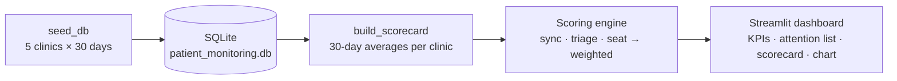

# Clinic Engagement System — Customer Health Scoring

A single-file [Streamlit](https://streamlit.io/) application for a **B2B2C Patient Remote Monitoring** company. It scores the health of each clinic (a B2B customer) from daily telemetry and surfaces which accounts are **Stable**, **At-Risk**, or **Critical** so Customer Success can prioritize outreach.

**🔗 Live demo:** [clinicengagementsystemcapstone.streamlit.app](https://clinicengagementsystemcapstone.streamlit.app)

[](https://clinicengagementsystemcapstone.streamlit.app)

## Overview

The platform combines three signals into a single weighted health score per clinic:

| Signal | Weight | Source metric | Interpretation |
| --- | --- | --- | --- |
| B2C Sync Compliance | 45% | `patient_sync_compliance` (%) | Share of patients syncing their monitoring devices |
| B2B Alert Triage | 35% | `alert_triage_hours` | Avg hours for clinic staff to triage clinical alerts (lower is better) |
| Seat Utilization | 20% | `clinician_login_count` vs licensed seats | Active clinician logins relative to purchased seats |

Composite score = `0.45 × sync + 0.35 × triage + 0.20 × seat`, then categorized:

- 🟢 **Stable** — score ≥ 80
- 🟠 **At-Risk** — 60 ≤ score < 80
- 🔴 **Critical** — score < 60

## Architecture

`app.py` is intentionally single-file but internally layered. The pure calculation engine has **no third-party dependencies** — `pandas` and `streamlit` are imported lazily inside the functions that need them, so the scoring logic (and its unit tests) can run without a web framework installed.



### Layers in `app.py`

- **Configuration & constants** — scoring weights, triage SLA thresholds, category cutoffs, and the static clinic roster used for seeding.
- **Calculation engine (pure functions)** — `clamp`, `score_sync`, `score_triage`, `score_seat_utilization`, `weighted_health_score`, and `categorize`. Deterministic and dependency-free.
- **Database layer** — `get_connection`, `init_db`, `seed_db`, and `ensure_database` auto-create and seed a mock SQLite database on first run (idempotent — it never double-seeds).
- **Scorecard aggregation** — `build_scorecard` averages each clinic's trailing 30 days of telemetry and applies the engine.
- **Presentation layer** — `render_sidebar`, `render_kpis`, `render_attention`, `render_health_chart`, `render_dashboard`, and `main` build the interactive dashboard. Accounts are surfaced worst-health-first throughout, with a prioritized attention list (filtered and sorted by status, then plan tier) rendered above the full scorecard and chart.

The Streamlit UI is guarded behind `if __name__ == "__main__": main()`, so `import app` (used by the tests) never triggers any rendering.

### Data model

`clinics`
- `id` — primary key
- `name` — unique clinic name
- `plan_tier` — Enterprise / Growth / Starter
- `licensed_seats` — purchased clinician seats

`telemetry`
- `id` — primary key
- `clinic_id` — FK → `clinics.id`
- `metric_date` — ISO date (one row per clinic per day)
- `patient_sync_compliance` — percent (0–100)
- `alert_triage_hours` — average hours to triage alerts
- `clinician_login_count` — daily active clinician logins

The database is seeded with **5 clinics × 30 days** of deterministic mock telemetry (fixed random seed) so results are reproducible.

## Project structure

```
.
├── app.py                      # Streamlit app + scoring engine (+ commented test suite)
├── test_app.py                 # 10 pytest unit tests for the scoring boundaries
├── requirements.txt            # streamlit, pandas, altair, pytest
├── docs/
│   └── design.md               # Software Design, Architecture & Testing Document
├── .github/workflows/test.yml  # CI: runs pytest on Python 3.10 / 3.11 / 3.12
└── README.md
```

## Setup

Requires **Python 3.9+** (CI validates on 3.10, 3.11, and 3.12).

```bash
# 1. Create and activate a virtual environment
python3 -m venv .venv
source .venv/bin/activate

# 2. Install dependencies
pip install -r requirements.txt
```

## Running the app

```bash
streamlit run app.py
```

Streamlit opens the dashboard in your browser. On first launch the app creates and seeds `patient_monitoring.db` in the working directory automatically — no manual database setup is required.

To use a different database location, set the `PRM_DB_PATH` environment variable:

```bash
PRM_DB_PATH=/tmp/prm.db streamlit run app.py
```

## Deployment

The application is a standard Streamlit app defined entirely by `app.py` and `requirements.txt`, so it runs anywhere Python 3.9+ is available. The SQLite database is created and seeded automatically on startup, so there is no separate provisioning step. On platforms with an ephemeral filesystem the database resets on each restart or redeploy; because the seed data is deterministic mock telemetry this is acceptable for a demo, and `PRM_DB_PATH` can point at persistent storage where durability is required.

### Option A — Streamlit Community Cloud

> **Deployed instance:** <https://clinicengagementsystemcapstone.streamlit.app>

1. Ensure the repository is pushed to GitHub (this project lives on `origin/main`).
2. In Streamlit Community Cloud, create a new app, select this repository and branch, and set the main file path to `app.py`.
3. Streamlit installs `requirements.txt` and launches the app automatically. Set `PRM_DB_PATH` and any future secrets under the app's **Advanced settings**.

### Option B — Docker

Create a `Dockerfile` in the project root:

```dockerfile
FROM python:3.12-slim
WORKDIR /app
COPY requirements.txt .
RUN pip install --no-cache-dir -r requirements.txt
COPY . .
EXPOSE 8501
CMD ["streamlit", "run", "app.py", "--server.port=8501", "--server.address=0.0.0.0"]
```

Build and run the container:

```bash
docker build -t clinic-health .
docker run -p 8501:8501 clinic-health
```

### Option C — Self-hosted server or VM

```bash
pip install -r requirements.txt
streamlit run app.py --server.port 8501 --server.address 0.0.0.0
```

The dashboard is served on port `8501`. For production, run the process under a supervisor (e.g., `systemd`) and place a reverse proxy such as Nginx in front to terminate TLS.

## Running the tests

The 10 unit tests in `test_app.py` verify the calculation boundaries (clamping, triage SLA normalization, seat-utilization edge cases, the weighted composite, and category cutoffs).

```bash
pytest -q
```

Because the scoring engine is dependency-free, the tests only need `pytest` itself:

```bash
pip install pytest
pytest -q
```

> The same suite is also embedded (commented out) at the bottom of `app.py` for quick reference.

## Continuous integration

`.github/workflows/test.yml` runs on every push and pull request to `main`. It uses `actions/checkout@v7` and `actions/setup-python@v6` (Node.js 24), installs `requirements.txt`, and runs `pytest -q` across a Python 3.10 / 3.11 / 3.12 matrix.
